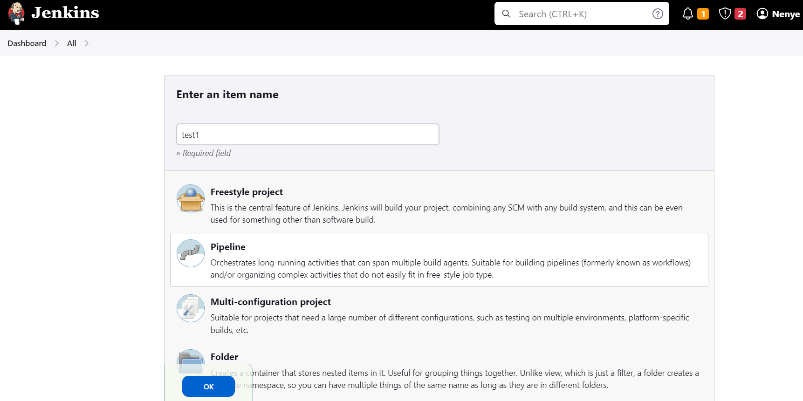
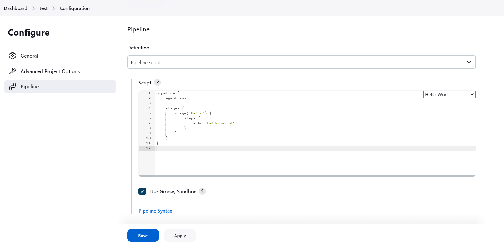

# Learning Jenkins Pipeline

This is just a basic guide to simulate how to set-up a Jenkins Pipeline 

---

**Sample Pipeline Script**

1. Bring up Jenkins Server
2. Go to Dashboard and select new item
3. Enter an item name and then Select Pipeline 
4. Click ok

    

5. Scroll down to the pipeline configuration and select Pipeline script from the definition tab

    

6. In the Script menu, select Hello World from the drop down list 
7. It would generate something like the below 

    ```groovy
    pipeline {
        agent any
        stages {
            stage('Hello') {
                steps {
                    echo 'Hello World'
                }
            }
        }
    }
    ```

8. Apply and save changes 
9. Select Build Now from the new Pipeline to test that your configuration works okay and you should now see below.

---

**If you wish to create your own pipeline script, please repeat step 2-6**

---

1. In the script menu, paste the below in the text editor

    ```groovy
   pipeline {
    agent any
    stages {
        stage('Hello') {
            steps {
                echo 'Hello World'
            }
        }
        stage('Welcome') {
            steps {
                echo 'Welcome to my Blog'
            }
        }
        stage('Project') {
            steps{
                echo 'This is a new pipeline project'
            }
        }
        stage('Features'){
            steps{
                dir('/home') {
                // some block
                    }
                }
            }
        }
    }
    ```

2. Apply and Save changes

3. Select Build Now from the new Pipeline to see the successful pipeline that have been created

    
